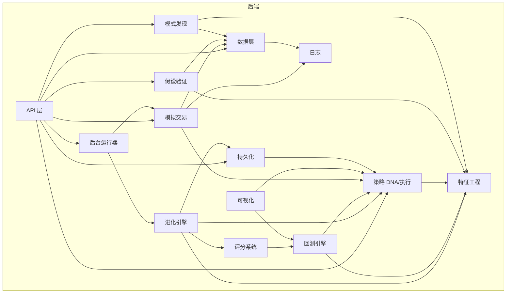
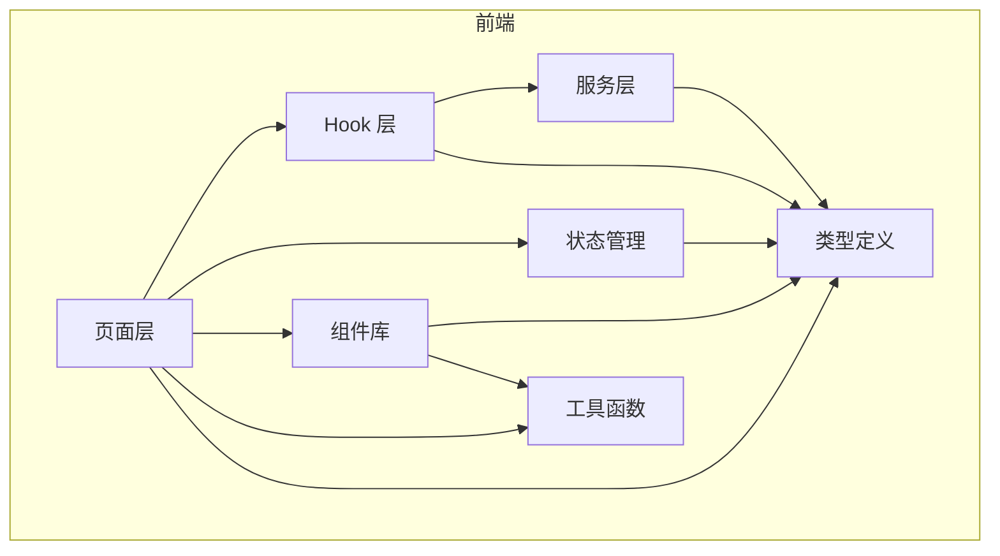

# MyQuant 工程地图

## 工程概述
BTC/ETH 量化交易策略进化工具。通过遗传算法自动搜索和优化交易策略，支持策略假设验证、回测评估、模拟纸盘交易和规律发现。
不做什么：不提供实盘交易执行、不提供账户管理、不支持非加密货币品种。

## 技术栈
| 类别 | 技术 |
|------|------|
| 后端语言 | Python 3.12+ |
| 后端框架 | FastAPI 0.100+ / Uvicorn |
| 前端语言 | TypeScript 6.0 |
| 前端框架 | React 19 / Vite 8 |
| 构建/包管理 | setuptools (后端) / npm (前端) |
| 数据库/存储 | SQLite (WAL) / Parquet 文件 |
| 核心计算库 | vectorbt 0.28.5 / pandas-ta / numba / sklearn |

## 架构风格
单体应用，前后端分离。后端采用分层架构（API 层 -> 核心领域层 -> 数据/基础设施层），核心领域层按业务能力拆分为独立模块。前端采用页面-服务-Hook 三层架构，使用 Zustand 管理 UI 状态，TanStack React Query 管理服务端数据。

## 工程类型分区
| 分区 | 路径 | 说明 |
|------|------|------|
| 后端 Python | `api/`, `core/`, `data/`, `migrations/` | FastAPI 服务 + 核心量化计算引擎 |
| 前端 Web | `web/` | React SPA，提供策略构建、进化监控、交易管理等交互界面 |

## 模块清单

### 后端模块
| 模块名 | 职责简述 | 边界 | 源码路径 | 发现方式 |
|--------|----------|------|----------|----------|
| strategy | 策略 DNA 基因组表示与信号执行 | DNA 数据结构定义、条件评估、信号生成，不含回测逻辑 | `core/strategy/` | 声明式 |
| backtest | 基于 vectorbt 的回测引擎 | 执行回测模拟，输出绩效指标，依赖 strategy 和 features | `core/backtest/` | 声明式 |
| data | K 线数据获取、存储、导入 | 币安数据拉取、Parquet 存储、CSV 导入、衍生品数据合并 | `core/data/` | 声明式 |
| features | 技术指标计算与注册表 | 30 个指标定义与计算、K 线形态检测、背离检测、信号构建 | `core/features/` | 声明式 |
| scoring | 策略评分系统 | 多维度指标标准化 + 模板加权评分，3 套评分模板 | `core/scoring/` | 声明式 |
| evolution | 遗传进化引擎 | 种群初始化、变异交叉、多样性维护、早停策略、冠军追踪 | `core/evolution/` | 声明式 |
| discovery | 模式发现引擎 | KNN 相似匹配、决策树规则提取、统计验证 | `core/discovery/` | 声明式 |
| validation | 假设验证引擎 | WHEN/THEN 规则验证、场景检测（6 种场景）、前瞻统计 | `core/validation/` | 声明式 |
| trading | 模拟纸盘交易 | 虚拟账户、仓位管理、判断规则、后台运行器 | `core/trading/` | 声明式 |
| persistence | 数据持久化层 | SQLite 表管理、进化快照存储、断点恢复 | `core/persistence/` | 声明式 |
| visualization | 图表可视化 | K 线图、权益曲线、代际趋势图生成（Plotly） | `core/visualization/` | 声明式 |
| logging | 日志配置 | 按模块和日期组织日志文件路径 | `core/logging/` | 声明式 |
| api | FastAPI HTTP/WS 接口层 | 路由定义、请求校验、WebSocket 推送、后台任务调度 | `api/` | 声明式 |

### 前端模块
| 模块名 | 职责简述 | 边界 | 源码路径 | 发现方式 |
|--------|----------|------|----------|----------|
| pages | 6 个页面组件 | 路由页面级组件，组合 services/hooks/components | `web/src/pages/` | 声明式 |
| services | API 服务层 | Axios HTTP 封装，每个领域一个 service 文件 | `web/src/services/` | 声明式 |
| hooks | React Query Hook 层 | query key factory + useMutation 封装，含 WebSocket 管理 | `web/src/hooks/` | 声明式 |
| stores | Zustand 状态管理 | 3 个 store：全局 UI 状态、实验室配置、图表设置 | `web/src/stores/` | 声明式 |
| components | UI 组件库 | 通用组件、业务组件（lab/evolution/trading/charts/layout） | `web/src/components/` | 声明式 |
| types | TypeScript 类型定义 | API 契约类型、策略类型、图表类型、场景类型 | `web/src/types/` | 声明式 |
| lib | 工具函数库 | DNA 生成器、策略工具函数、常量定义 | `web/src/lib/` | 声明式 |

## 模块依赖关系

## 关键约束
- 部署环境：本地开发环境，API 端口 8000，前端开发代理至后端
- 数据源：币安公共 API（无需 API Key 获取 K 线），期货数据需环境变量
- 存储约束：SQLite 单文件数据库 + Parquet 文件，不支持分布式
- 计算约束：回测使用 vectorbt + numba JIT 加速，进化支持多进程并行（n_workers 配置）
- API Key 安全：通过环境变量 `${BINANCE_API_KEY}` / `${ANTHROPIC_API_KEY}` 引用，禁止硬编码

---
_生成时间：2026-05-12T00:00:00+08:00 | Git Commit：ccbc26302be1c9bc377586642b871b882f8d5c10_
