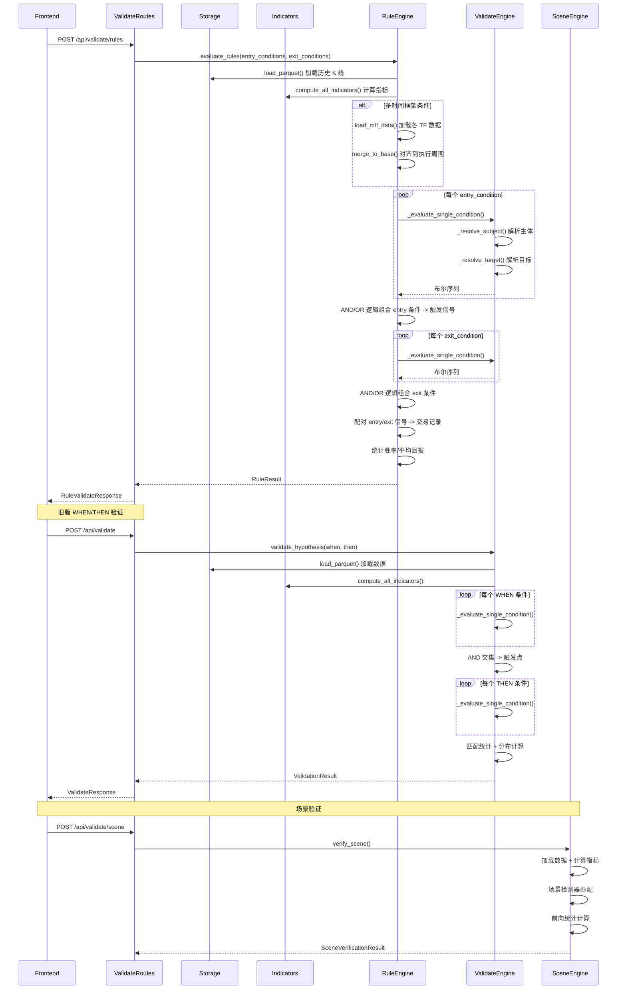

# 假设验证流程

## 流程概述
用户提交 WHEN/THEN 交易假设（规则条件组），系统在历史数据上评估条件匹配、生成交易信号、统计胜率和分布，并返回验证结果。

## 触发入口
| 入口 | 类型 | 触发条件 |
|------|------|----------|
| POST /api/validate/rules | HTTP API | 用户提交规则条件验证 (新版) |
| POST /api/validate | HTTP API | 用户提交 DNA 验证 (旧版 WHEN/THEN) |
| POST /api/validate/scene | HTTP API | 场景验证 (由 scene 路由处理) |

## 模块序列


## 数据转换规则
| 节点 | 输入 | 转换逻辑 | 输出 |
|------|------|----------|------|
| ValidateRoutes.run_rule_validation | RuleValidateRequest | 解析 entry/exit 条件组、调用 rule_engine | RuleValidateResponse |
| ValidateRoutes.run_validation | ValidateRequest | 解析 WHEN/THEN 条件组、调用 engine | ValidateResponse |
| RuleEngine.evaluate_rules | entry/exit conditions + 数据配置 | 加载数据 -> 计算指标 -> 逐条件评估 -> 信号配对 -> 统计 | RuleResult |
| ValidateEngine._evaluate_single_condition | condition dict + DataFrame | 解析 subject/action/target -> 布尔序列 | pd.Series (bool) |
| ValidateEngine._resolve_subject | subject str + DataFrame | 指标名/价格列/派生列 -> 对应 Series | pd.Series |
| ValidateEngine._resolve_target | target str + value | 数值/百分比/指标引用 -> 阈值 | float |
| 条件组合 | 多个布尔序列 + logic | AND: 全部为 True / OR: 任一为 True | 合并布尔序列 |
| 信号配对 | entry_signals + exit_signals | entry -> 最近的 exit 配对 -> 计算回报 | List[TradeRecord] |
| 统计聚合 | List[TradeRecord] | 胜率/平均回报/总回报/交易分布 | win_rate + avg_return + trades |

条件类型 (action):
- rises / falls: 指标值上升/下降
- crosses_above / crosses_below: 穿越阈值或其他指标
- above / below / equals: 与阈值比较
- in_zone: 在区间内

## 状态变迁链
假设验证为同步 HTTP 请求，无异步状态变迁:

```
请求到达 -> 数据加载 -> 指标计算 -> 条件评估 -> 信号配对 -> 统计计算 -> 响应返回
```

错误处理:
- 数据文件不存在 -> HTTP 404
- 条件格式无效 -> 跳过该条件 (warnings 记录)
- 指标计算失败 -> 跳过 (warnings 记录)

## 源码锚点
- [api/routes/validate.py:110-158] run_validation() 旧版 WHEN/THEN 路由
- [api/routes/validate.py:173-216] run_rule_validation() 新版规则验证路由
- [core/validation/engine.py:1-46] ValidationResult / TriggerRecord 数据结构
- [core/validation/engine.py:48+] validate_hypothesis() 旧版验证主函数
- [core/validation/engine.py] _evaluate_single_condition() 单条件评估
- [core/validation/rule_engine.py:1-50] RuleResult / RuleSignal / TradeRecord 数据结构
- [core/validation/rule_engine.py] evaluate_rules() 规则评估主函数
- [core/validation/scene/scene_engine.py:1-30] SceneEngine 场景验证编排器
- [core/data/storage.py] load_parquet() Parquet 数据加载
- [core/features/indicators.py] compute_all_indicators() 全量指标计算
- [core/validation/mtf.py] load_mtf_data() / merge_to_base() 多时间框架数据处理
