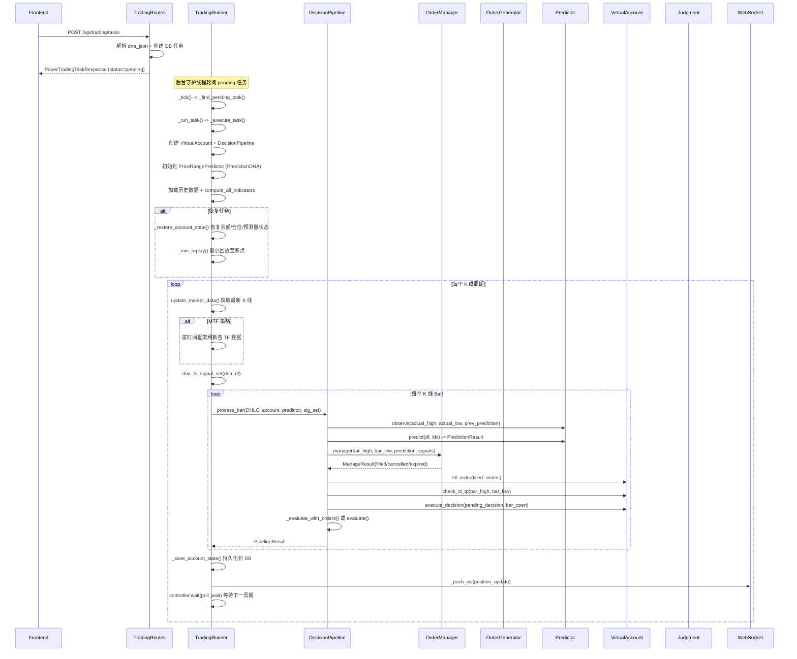

# 模拟纸盘交易流程

## 流程概述
用户创建模拟交易任务，后台守护线程实时获取最新 K 线数据，通过 DecisionPipeline 逐 K 线执行观察→预测→订单管理→SL/TP→信号评估的完整决策流程，虚拟账户管理仓位和权益，通过 WebSocket 推送实时状态。

## 触发入口
| 入口 | 类型 | 触发条件 |
|------|------|----------|
| POST /api/trading/tasks | HTTP API | 用户提交模拟交易任务 |
| POST /api/trading/tasks/{id}/resume | HTTP API | 恢复已暂停的任务 |
| TradingRunner._tick() | 后台轮询 | 守护线程每 2 秒检测 pending 状态任务 |

## 模块序列


## 数据转换规则
| 节点 | 输入 | 转换逻辑 | 输出 |
|------|------|----------|------|
| TradingRoutes.create_task | PaperTradingTaskCreate payload | 解析 DNA、验证格式、写入 DB | PaperTradingTaskResponse (status=pending) |
| TradingRunner._execute_task | DB task_row | 创建 VirtualAccount/DecisionPipeline/Predictor、加载数据、恢复状态 | 运行上下文 |
| DecisionPipeline.process_bar | OHLCV + account + predictor + sig_set | 观察→预测→订单管理→SL/TP→执行→信号评估 | PipelineResult |
| OrderManager.manage | bar_high/low + prediction + signals | 成交检查→信号反转检查→预测覆盖检查→超时检查 | ManageResult |
| OrderGenerator.generate_order | BarSignals + PredictionResult + AccountState | alpha 定价 + 正态 CDF 成交概率 | Order 或 None |
| Judgment.evaluate | BarSignals + AccountState + JudgmentConfig | 6 条优先级规则判定 | Decision |
| VirtualAccount.fill_order | Order | 从订单信息开仓/加仓 | 事件列表 |
| VirtualAccount.check_sl_tp | bar_high, bar_low | SL 在触发价执行，TP 在目标价执行，SL 优先于 TP | 事件列表 |

限价单定价逻辑：
- alpha = config.pricing_alpha_base + config.pricing_alpha_range * confidence
- long: price = mu - alpha * sigma，限制在 [pred_low, mid]
- short: price = mu + alpha * sigma，限制在 [mid, pred_high]
- fill_probability = norm.cdf((price - mu) / sigma)
- 低于 min_fill_prob 时回退为市价单

订单取消条件（按优先级）：
1. 信号反转（exit/reduce 信号出现）
2. 预测偏移（订单价格超出当前预测区间）
3. 超时（等待超过 order_max_wait_bars）

## 状态变迁链
```
pending -> running -> (实时推送 position_update) -> stopped
pending -> running -> (实时推送 position_update) -> paused
pending -> running -> (实时推送 position_update) -> error

控制操作:
  running -> paused   (用户暂停，保存 pending_decision)
  paused  -> pending  (用户恢复，最小回放后继续)
  running -> stopped  (用户停止)
  stopped -> pending  (用户重启，创建新任务复制原参数)

崩溃恢复:
  running -> stopped  (crash_recovery, 启动时标记)
  恢复后: pending -> running -> _restore_account_state() + _min_replay()
```

数据持久化频率:
- 每个 K 线周期: 保存账户状态 (余额/仓位/交易统计)
- 每个交易事件: 保存到 paper_trade 表
- 每个周期: 保存权益快照到 equity_snapshot 表
- 恢复时: 保存 pending_decision_json + prediction_state_json 供下次恢复

## 源码锚点
- [api/routes/trading.py:72-100] 创建交易任务路由 (create_task)
- [api/routes/trading.py:129-185] stop/pause/resume/restart 控制路由
- [core/trading/runner.py:100-413] TradingRunner 守护线程 + _execute_task() 主流程
- [core/trading/runner.py:46-64] TaskController 协作式取消 (支持 pause/stop)
- [core/trading/pipeline.py:37-200] DecisionPipeline.process_bar() 核心决策管线
- [core/trading/pipeline.py:202-250] _evaluate_with_orders() 限价单路径信号评估
- [core/trading/order_generator.py:9-50] compute_order_price() 限价定价
- [core/trading/order_generator.py:53-126] generate_order() 订单生成
- [core/trading/order_manager.py:18-130] OrderManager.manage() 订单生命周期
- [core/trading/account.py:23-522] VirtualAccount 虚拟账户 (SL/TP/强平/资金费率)
- [core/trading/judgment.py:13-128] evaluate() 6 条判断规则
- [core/trading/types.py:8-213] 所有数据结构定义
- [core/trading/replay.py:41-161] ReplayRunner 历史回放
