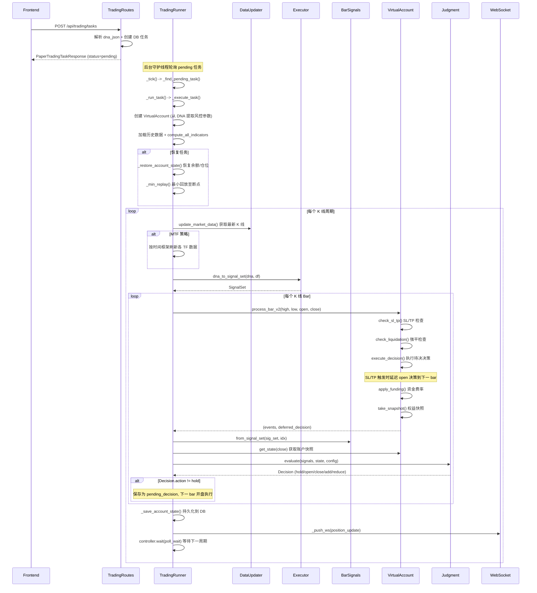

# 模拟纸盘交易流程

## 流程概述
用户创建模拟交易任务，后台守护线程实时获取最新 K 线数据，生成信号并通过判断规则执行交易决策，虚拟账户管理仓位和权益，通过 WebSocket 推送实时状态。

## 触发入口
| 入口 | 类型 | 触发条件 |
|------|------|----------|
| POST /api/trading/tasks | HTTP API | 用户提交模拟交易任务 |
| POST /api/trading/tasks/{id}/resume | HTTP API | 恢复已暂停的任务 |
| TradingRunner._tick() | 后台轮询 | 守护线程每 2 秒检测 pending 状态任务 |

## 模块序列


## 数据转换规则
| 节点 | 输入 | 转换逻辑 | 输出 |
|------|------|----------|------|
| TradingRoutes.create_task | PaperTradingTaskCreate payload | 解析 DNA、验证格式、写入 DB | PaperTradingTaskResponse (status=pending) |
| TradingRunner._execute_task | DB task_row | 创建 VirtualAccount、加载数据、恢复状态 | 运行上下文 |
| Executor.dna_to_signal_set | StrategyDNA + DataFrame | 同回测流程: 基因 -> 指标 -> 条件 -> 信号组合 | SignalSet |
| BarSignals.from_signal_set | SignalSet + bar index | 从完整序列中提取单 bar 的 entry/exit/add/reduce/direction/confidence | BarSignals (标量值) |
| VirtualAccount.get_state | current_price | 余额 + 仓位 + 未实现盈亏 -> 快照 | AccountState |
| Judgment.evaluate | BarSignals + AccountState + JudgmentConfig | 6 条优先级规则判定 | Decision (action/direction/size) |
| VirtualAccount.process_bar_v2 | OHLCV + pending_decision | SL/TP -> 强平 -> 执行决策 -> 资金费率 -> 快照 | (events, deferred_decision) |
| VirtualAccount.execute_decision | Decision + open_price | open/close/add/reduce 对应操作 | 事件列表 |

判断规则优先级:
1. max_hold_bars 安全阀: 亏损持仓超时强制平仓
2. 退出/减仓信号 + 有仓位 -> 检查持仓时间和最小盈利
3. 入场信号 + 无仓位 -> 初始建仓 (initial_entry_pct)
4. 入场信号 + 同向仓位 -> 盈利加仓
5. 入场信号 + 反向仓位 -> 先平仓
6. 无信号 -> 盈利持续加仓 (受 max_fill_bars 限制)

## 状态变迁链
```
pending -> running -> (实时推送 position_update) -> stopped
pending -> running -> (实时推送 position_update) -> paused
pending -> running -> (实时推送 position_update) -> error

控制操作:
  running -> paused   (用户暂停，保存 pending_decision)
  paused  -> pending  (用户恢复，最小回放后继续)
  running -> stopped  (用户停止)
  stopped -> pending  (用户重启，创建新任务复制原参数)

崩溃恢复:
  running -> stopped  (crash_recovery, 启动时标记)
  恢复后: pending -> running -> _restore_account_state() + _min_replay()
```

数据持久化频率:
- 每个 K 线周期: 保存账户状态 (余额/仓位/交易统计)
- 每个交易事件: 保存到 paper_trade 表
- 每个周期: 保存权益快照到 equity_snapshot 表
- 恢复时: 保存 pending_decision_json 供下次恢复

## 源码锚点
- [api/routes/trading.py:72-100] 创建交易任务路由 (create_task)
- [api/routes/trading.py:129-185] stop/pause/resume/restart 控制路由
- [core/trading/runner.py:100-413] TradingRunner 守护线程 + _execute_task() 主流程
- [core/trading/runner.py:46-64] TaskController 协作式取消 (支持 pause/stop)
- [core/trading/runner.py:450-495] _min_replay() 恢复回放
- [core/trading/runner.py:521-562] _restore_account_state() / _restore_balance_and_position()
- [core/trading/judgment.py:13-136] evaluate() 6 条判断规则
- [core/trading/account.py:23-427] VirtualAccount 虚拟账户 (SL/TP/强平/资金费率)
- [core/trading/account.py:379-426] process_bar_v2() 每 bar 原子处理
- [core/trading/position.py:27-56] Position / ClosedTrade / EquitySnapshot 数据类
- [core/trading/types.py:9-96] Decision / AccountState / BarSignals / JudgmentConfig 类型定义
- [core/data/updater.py] update_market_data() 实时数据更新
- [api/routes/ws.py:148-201] WebSocket 交易状态推送端点
