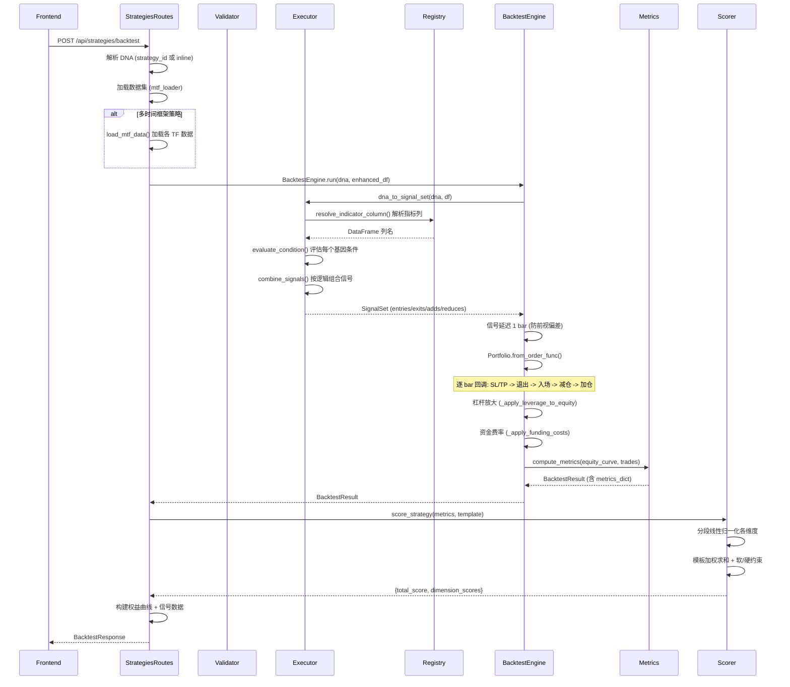

# 策略回测流程

## 流程概述
用户提交策略 DNA，系统生成交易信号、执行回测模拟、计算评分指标并返回完整回测报告。

## 触发入口
| 入口 | 类型 | 触发条件 |
|------|------|----------|
| POST /api/strategies/backtest | HTTP API | 用户在 Lab 页面提交 DNA 回测请求 |
| POST /api/strategies (创建策略) | HTTP API | 创建策略时可选附带回测 |
| POST /api/strategies/compare | HTTP API | 批量对比多个策略的回测结果 |

## 模块序列


## 数据转换规则
| 节点 | 输入 | 转换逻辑 | 输出 |
|------|------|----------|------|
| StrategiesRoutes.backtest_strategy | BacktestRequest payload | 解析 strategy_id/inline DNA、加载数据、创建引擎 | 调用上下文 |
| DNA 解析 | JSON DNAModel 或 DB dna_json | Pydantic 反序列化 -> StrategyDNA 数据类 | StrategyDNA |
| Executor.dna_to_signal_set | StrategyDNA + enhanced_df | 遍历 signal_genes -> 解析指标列 -> 评估条件 -> 按角色分组 -> 按逻辑组合 | SignalSet (4 组布尔序列) |
| Executor.evaluate_condition | indicator_series + condition dict | 按 type 分派: eq/lt/gt/cross_above/price_above/lookback_any 等 15+ 种 | pd.Series (bool) |
| Registry.resolve_indicator_column | indicator + params + field + naming | 拼接列名: INDICATOR_param1_param2[_field] | DataFrame 列名 |
| BacktestEngine._build_portfolio | SignalSet + DataFrame + risk params | 信号 shift(1) -> 2D numpy -> vbt.Portfolio.from_order_func | vectorbt Portfolio |
| order_func_nb (Numba) | entries/exits/adds/reduces + 风控参数 | 逐 bar: SL/TP(用 HIGH/LOW) -> 强平 -> 退出 -> 入场 -> 减仓 -> 加仓 | 订单序列 |
| BacktestEngine._build_result_from_portfolio | Portfolio + DNA | 权益曲线提取 -> 杠杆放大 -> 资金费率 -> compute_metrics | BacktestResult |
| Scorer.score_strategy | metrics dict + template | 各维度归一化 -> 加权求和 -> 硬约束(清零) -> 软约束(惩罚) | {total_score, dimension_scores, raw_metrics} |

评分模板维度:
- explorer (默认): annual_return(0.30) + sharpe_ratio(0.25) + max_drawdown(0.20) + win_rate(0.15) + trade_count_penalty(0.10)
- optimizer: 各维度均衡权重
- max_return: 年化回报权重最高

## 状态变迁链
回测为同步 HTTP 请求，无异步状态变迁。完整生命周期:

```
请求到达 -> DNA 解析 -> 数据加载 -> 信号生成 -> 回测执行 -> 评分计算 -> 响应返回
```

错误处理:
- DNA 无效 -> HTTP 400
- 数据集不存在 -> HTTP 404
- 策略不存在 (strategy_id) -> HTTP 404
- 回测执行异常 -> 0 分兜底 (不抛出错误)

## 源码锚点
- [api/routes/strategies.py:195-384] backtest_strategy 路由
- [api/routes/strategies.py:387-507] compare_strategies 批量对比路由
- [core/strategy/validator.py:19-136] validate_dna() DNA 合法性校验
- [core/strategy/executor.py:489-745] dna_to_signal_set() DNA -> SignalSet 转换
- [core/strategy/executor.py:31-107] evaluate_condition() 条件评估 (15+ 种类型)
- [core/strategy/executor.py:272-288] combine_signals() AND/OR 逻辑组合
- [core/features/registry.py] resolve_indicator_column() 指标列名解析
- [core/backtest/engine.py:396-623] BacktestEngine + run() + batch_run()
- [core/backtest/engine.py:205-393] order_func_nb (Numba JIT) 逐 bar 回调
- [core/backtest/engine.py:73-130] _apply_funding_costs() 资金费率
- [core/backtest/engine.py:133-189] _apply_leverage_to_equity() 杠杆放大
- [core/scoring/scorer.py:27-152] score_strategy() 综合评分
- [core/scoring/metrics.py] compute_metrics() 指标计算
- [core/scoring/templates.py] 评分模板定义 (explorer/optimizer/max_return 等)
- [core/scoring/normalizer.py] normalize() 分段线性归一化
