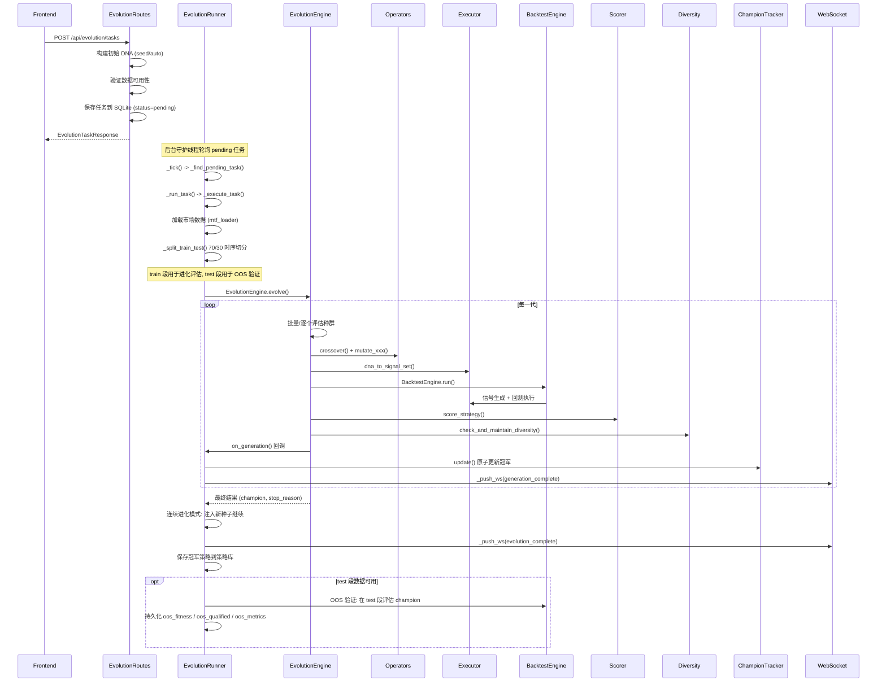

# 策略进化流程

## 流程概述
用户通过 API 创建进化任务，后台守护线程执行遗传算法搜索最优策略，通过 WebSocket 实时推送代际进度，最终将冠军策略保存到策略库。进化评估使用 train 段数据（默认 70%），进化完成后在 test 段（30%）对 champion 进行样本外（OOS）验证。

## 触发入口
| 入口 | 类型 | 触发条件 |
|------|------|----------|
| POST /api/evolution/tasks | HTTP API | 用户提交进化任务（auto 模式或 seed 模式） |
| POST /api/evolution/tasks/{id}/resume | HTTP API | 恢复已暂停的任务 |
| EvolutionRunner._tick() | 后台轮询 | 守护线程每 2 秒检测 pending 状态任务 |

## 模块序列


## 数据转换规则
| 节点 | 输入 | 转换逻辑 | 输出 |
|------|------|----------|------|
| EvolutionRoutes.create_task | EvolutionTaskCreate payload | 解析参数、构建 StrategyDNA、验证数据、写入 DB | EvolutionTaskResponse (status=pending) |
| EvolutionRunner._execute_task | DB task_row | 加载数据 (mtf_loader)、时序切分 train/test、创建 EvolutionEngine、注册回调 | 后台执行上下文 |
| _split_train_test | DataFrame | 按 train_ratio（默认 0.7）时序切分，min_bars=100 以下不切分 | (train_df, test_df) |
| EvolutionEngine.evolve | ancestor DNA + evaluate_fn | 初始化种群 -> 循环(评估->选择->交叉->变异->多样性维护) | {champion, history, stop_reason} |
| Operators (13个算子) | StrategyDNA | mutate_params / mutate_indicator / mutate_logic / mutate_risk / crossover 等 | 变异后的 StrategyDNA |
| Executor.dna_to_signal_set | StrategyDNA + DataFrame | 解析基因 -> 计算指标列 -> 评估条件 -> 组合信号 | SignalSet (entries/exits/adds/reduces) |
| BacktestEngine.run | StrategyDNA + DataFrame + SignalSet | from_order_func 执行回测 + 杠杆放大 + 资金费率 | BacktestResult |
| Scorer.score_strategy | metrics dict + template | 分段线性归一化 + 模板加权 + 软/硬约束 | {total_score, dimension_scores} |
| ChampionTracker.update | score + metrics | 线程安全原子比较更新 | ChampionRecord |
| EvolutionRunner.on_generation | gen + best_score + avg_score | 写入历史、保存快照、自动提取达标策略、WS 推送 | DB 更新 + WS payload |
| OOS 验证 | champion DNA + test_df | 在 test 段重新回测 champion，计算 oos_fitness，写入 DB | oos_fitness / oos_qualified / oos_metrics |

## 状态变迁链
```
pending -> running -> (每代更新 generation_complete) -> completed
pending -> running -> (每代更新 generation_complete) -> early_stopped
pending -> running -> error

运行中支持控制操作:
  running -> paused   (用户暂停)
  paused  -> pending  (用户恢复，runner 重新拾取)
  running -> stopped  (用户停止 / 崩溃恢复 / 心跳超时)

连续进化模式:
  running -> running (种群完成自动注入新种子继续)
  崩溃恢复: running -> stopped (crash_recovery, 启动时清理)
```

停止原因 (stop_reason):
- target_reached: 达到目标分数
- stagnation: 连续 N 代无改善
- decline: 连续 N 代衰退
- max_generations: 达到最大代数
- user_stop: 用户手动停止
- error: 执行异常
- crash_recovery: 崩溃恢复标记
- no_data / invalid_dna: 数据或 DNA 无效

## 源码锚点
- [api/routes/evolution.py:179-319] 创建进化任务路由 (create_task)
- [api/runner.py:177-683] EvolutionRunner 守护线程 + _execute_task() 主流程
- [api/runner.py:_split_train_test] 时序切分 train/test（默认 70/30）
- [api/runner.py:OOS验证块] champion 样本外验证 + 持久化
- [api/db_ext.py:022] oos_fitness / oos_qualified / oos_metrics 列迁移
- [api/runner.py:52-67] TaskController 协作式取消 (threading.Event)
- [core/evolution/engine.py:162-440] EvolutionEngine.evolve() 主循环
- [core/evolution/engine.py:23-89] EarlyStopChecker 4 条停止规则
- [core/evolution/engine.py:92-122] _AdaptiveMutationController 1/5 自适应变异
- [core/evolution/operators.py:372-780] 13 个变异/交叉算子
- [core/strategy/executor.py:489-745] dna_to_signal_set() DNA -> 信号转换
- [core/backtest/engine.py:396-623] BacktestEngine.run() 回测执行
- [core/scoring/scorer.py:27-152] score_strategy() 综合评分
- [core/evolution/champion.py:22-73] ChampionTracker 原子冠军追踪
- [core/evolution/diversity.py:1-30] 多样性检查 + 种群维护
- [api/routes/ws.py:92-141] WebSocket 进化进度推送端点
- [core/persistence/db.py] 任务/历史/快照持久化
