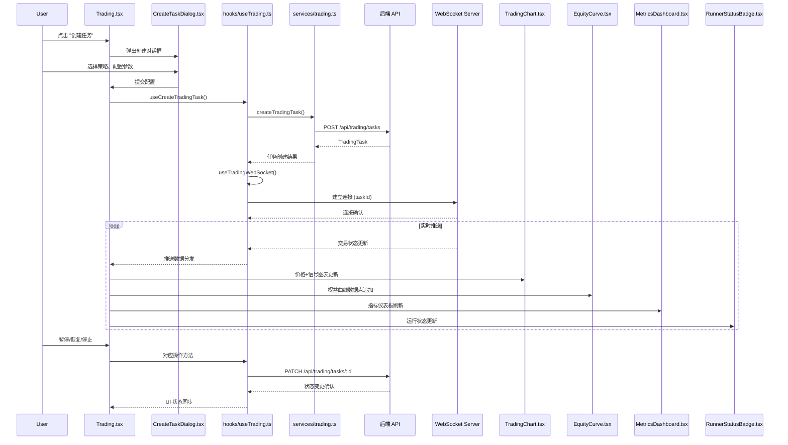

# 模拟交易管理流程

## 流程概述

用户创建模拟交易任务（选择策略+配置参数），通过 WebSocket 实时接收交易状态更新，查看权益曲线、交易记录、指标仪表板，支持暂停/恢复/停止操作。

## 触发入口

| 入口 | 类型 | 触发条件 |
|------|------|----------|
| Trading 页面 "创建任务" 按钮 | 用户交互 | 用户点击创建任务，弹出配置对话框 |
| Trading 页面 "暂停" 按钮 | 用户交互 | 交易任务运行中，用户点击暂停 |
| Trading 页面 "恢复" 按钮 | 用户交互 | 交易任务已暂停，用户点击恢复 |
| Trading 页面 "停止" 按钮 | 用户交互 | 交易任务运行中或已暂停，用户点击停止 |
| Trading 页面 "删除" 按钮 | 用户交互 | 交易任务已停止，用户点击删除 |

## 模块序列

## 数据转换规则

| 节点 | 输入 | 转换逻辑 | 输出 |
|------|------|----------|------|
| CreateTaskDialog | 用户选择的策略ID、交易对、杠杆倍数、初始资金等参数 | 校验参数合法性（策略存在性、交易对格式、杠杆范围），组装为创建请求 | CreateTradingTaskParams (POST body) |
| createTradingTask | CreateTradingTaskParams | 发送 POST 请求创建模拟交易任务 | TradingTask |
| useTradingWebSocket | TradingTask.taskId | 以 taskId 建立 WebSocket 连接，监听交易状态推送 | 实时推送消息流 |
| TradingChart | WebSocket push (K线数据 + 买卖信号) | 将价格数据和交易信号叠加渲染到图表 | 价格走势图 + 信号标记 |
| EquityCurve | EquitySnapshot[] (WebSocket push) | 追加权益快照数据点，绘制权益随时间的变化曲线 | 权益曲线图 |
| MetricsDashboard | WebSocket push (实时指标) | 计算并展示收益率、最大回撤、夏普比率、胜率等核心指标 | 指标卡片组 |
| RunnerStatusBadge | TradingTask.status + WebSocket push | 映射任务状态为徽章颜色和文案 | 状态徽章 UI |

## 状态变迁链

创建 -> 初始化中 -> 运行中（实时推送交易状态） -> 已暂停 / 已停止 / 错误

支持的完整状态流转：
- 运行中 -> 已暂停：用户主动暂停，WebSocket 保持连接但停止接收新交易
- 已暂停 -> 运行中：用户恢复，继续执行交易逻辑
- 运行中/已暂停 -> 已停止：用户主动停止，终止模拟交易，保留已有数据
- 已停止 -> 已重启：用户基于已停止任务重新启动
- 已停止 -> 已删除：用户删除任务及关联数据

错误处理：
- 运行中 -> 错误：后端异常导致任务中断，展示错误信息，提供重试入口
- WebSocket 断连：自动重连机制，重连期间展示断连提示，重连成功后补推缺失数据

## 源码锚点

- [-> web/src/pages/Trading.tsx] 交易管理主页面，承载任务创建、实时监控、状态操作的整体交互编排
- [-> web/src/hooks/useTrading.ts] useCreateTradingTask + useTradingWebSocket，封装交易任务创建和 WebSocket 实时通信逻辑
- [-> web/src/services/trading.ts] createTradingTask 服务层，对接 POST /api/trading/tasks 接口
- [-> web/src/components/trading/CreateTaskDialog.tsx] 创建任务对话框，提供策略选择和交易参数配置
- [-> web/src/components/trading/TradingChart.tsx] 交易图表组件，展示价格走势和买卖信号标记
- [-> web/src/components/trading/EquityCurve.tsx] 权益曲线组件，实时绘制账户权益变化
- [-> web/src/components/trading/MetricsDashboard.tsx] 指标仪表板组件，展示核心交易绩效指标
- [-> web/src/components/trading/RunnerStatusBadge.tsx] 运行状态徽章组件，展示任务当前运行状态
