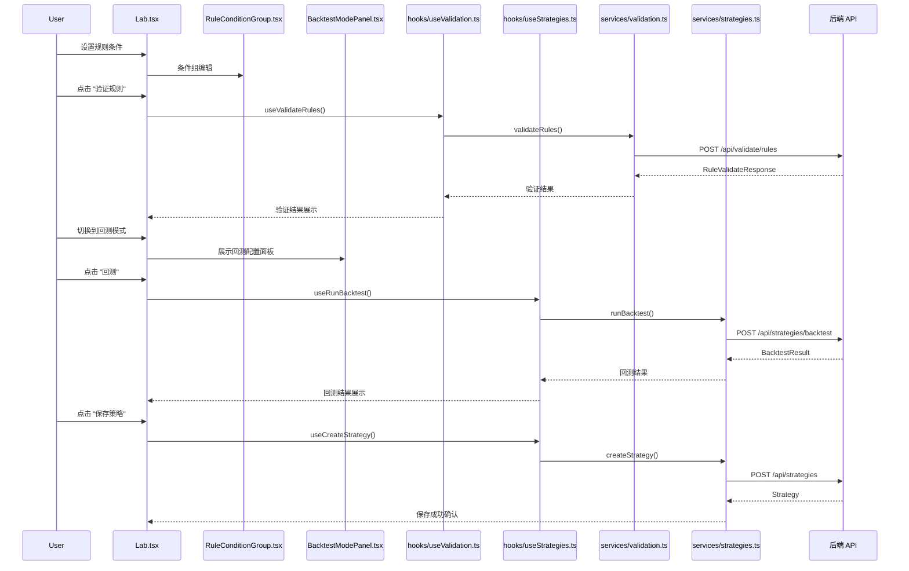

# 策略构建与回测流程

## 流程概述

用户在 Lab 页面通过可视化规则条件构建器组织 WHEN/THEN 逻辑，提交后端进行假设验证或回测，查看结果后可保存为策略。

## 触发入口

| 入口 | 类型 | 触发条件 |
|------|------|----------|
| Lab 页面 "验证规则" 按钮 | 用户交互 | 规则条件编辑完成后，用户点击触发验证 |
| Lab 页面 "回测" 按钮 | 用户交互 | 规则验证通过后，用户切换到回测模式并点击回测 |
| Lab 页面 "保存策略" 按钮 | 用户交互 | 回测结果满意后，用户点击保存策略 |

## 模块序列

## 数据转换规则

| 节点 | 输入 | 转换逻辑 | 输出 |
|------|------|----------|------|
| RuleConditionGroup | 用户交互输入（指标选择、比较运算符、阈值） | 将表单字段映射为结构化条件对象，按 WHEN/THEN 分组 | RuleCondition[] |
| useValidateRules | RuleCondition[] | 组装为后端验证请求体，附带规则 DNA | RuleValidateRequest (POST body) |
| Lab 验证结果展示 | RuleValidateResponse | 解析触发时间表和验证结论，分发到对应展示组件 | TriggerTable / ValidationConclusion |
| BacktestModePanel | DNA + 回测参数（时间范围、初始资金等） | 将策略 DNA 与回测配置合并为回测请求 | BacktestRequest |
| Lab 回测结果展示 | BacktestResult | 解析收益曲线、交易记录、风险指标等，分发到 BacktestMetricsPanel | 回测指标面板数据 |

## 状态变迁链

规则编辑 -> 验证中（loading） -> 验证完成（成功/失败）
验证成功 -> 回测配置 -> 回测中（loading） -> 回测完成（成功/失败）
回测成功 -> 保存确认 -> 保存中 -> 保存完成（策略已入库）

关键状态保护：验证未通过时不可进入回测；回测未完成时不可保存策略。

## 源码锚点

- [-> web/src/pages/Lab.tsx] 实验室主页面，承载规则编辑、验证、回测、保存的整体交互编排
- [-> web/src/components/lab/RuleConditionGroup.tsx] 条件组编辑组件，负责 WHEN/THEN 规则的可视化构建
- [-> web/src/components/lab/BacktestModePanel.tsx] 回测模式面板，提供回测参数配置和回测结果展示
- [-> web/src/hooks/useValidation.ts] useValidateRules hook，封装规则验证的请求逻辑和状态管理
- [-> web/src/hooks/useStrategies.ts] useRunBacktest / useCreateStrategy hook，封装回测执行和策略保存逻辑
- [-> web/src/services/validation.ts] validateRules 服务层，对接 POST /api/validate/rules 接口
- [-> web/src/services/strategies.ts] runBacktest 服务层，对接 POST /api/strategies/backtest 接口
