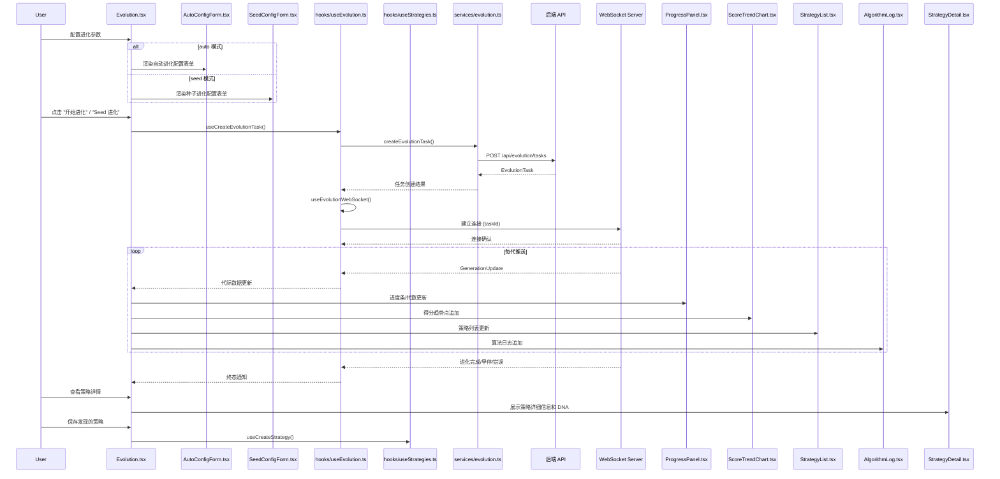

# 进化监控流程

## 流程概述

用户创建进化任务（auto/seed 模式），通过 WebSocket 实时接收代际进度更新，查看得分趋势、策略列表、算法日志，进化完成后可保存发现的策略。

## 触发入口

| 入口 | 类型 | 触发条件 |
|------|------|----------|
| Evolution 页面 "开始进化" 按钮 (auto 模式) | 用户交互 | 用户完成自动进化参数配置后点击触发 |
| Evolution 页面 "Seed 进化" 按钮 (seed 模式) | 用户交互 | 用户选择种子策略并完成参数配置后点击触发 |
| Evolution 页面 "暂停/恢复/停止" 按钮 | 用户交互 | 进化任务运行中，用户手动干预任务状态 |

## 模块序列

## 数据转换规则

| 节点 | 输入 | 转换逻辑 | 输出 |
|------|------|----------|------|
| AutoConfigForm / SeedConfigForm | 用户配置的进化参数（种群大小、代数上限、变异率、种子策略ID等） | 校验参数合法性，组装为统一请求结构 | CreateEvolutionTaskRequest |
| createEvolutionTask | CreateEvolutionTaskRequest | 发送 POST 请求创建进化任务，返回任务对象 | EvolutionTask |
| useEvolutionWebSocket | EvolutionTask.taskId | 以 taskId 建立 WebSocket 连接，监听代际推送消息 | GenerationUpdate[] |
| ProgressPanel | GenerationUpdate (当前代数/总代数) | 计算进度百分比，更新进度条和代数文案 | 进度条百分比 + 代数文案 |
| ScoreTrendChart | GenerationUpdate (每代最优得分) | 追加数据点到趋势图，实时绘制得分变化曲线 | 得分趋势图 |
| StrategyList | GenerationUpdate (本代发现的策略) | 合并去重策略列表，按得分排序展示 | 策略列表 UI |
| AlgorithmLog | GenerationUpdate (算法日志文本) | 追加日志行，保持自动滚动到底部 | 算法日志面板 |
| 策略保存 | DiscoveredStrategy | 提取策略 DNA 和元数据，转换为策略持久化结构 | Strategy (入库) |

## 状态变迁链

创建 -> 初始化中 -> 运行中（实时代际推送） -> 完成 / 早停 / 错误

支持的中途操作：
- 暂停：运行中 -> 已暂停（保留当前代际状态，WebSocket 保持连接）
- 恢复：已暂停 -> 运行中（从暂停代际继续）
- 停止：运行中/已暂停 -> 已停止（终止进化，释放资源）

终态处理：
- 完成：自动断开 WebSocket，展示最终汇总结果，开放策略保存操作
- 早停：收敛条件触发，视为完成处理
- 错误：展示错误信息，提供重试入口

## 源码锚点

- [-> web/src/pages/Evolution.tsx] 进化中心主页面，承载进化任务配置、实时监控、策略查看的整体交互
- [-> web/src/hooks/useEvolution.ts] useCreateEvolutionTask + useEvolutionWebSocket，封装进化任务创建和 WebSocket 实时通信逻辑
- [-> web/src/services/evolution.ts] createEvolutionTask 服务层，对接 POST /api/evolution/tasks 接口
- [-> web/src/components/evolution/ProgressPanel.tsx] 进度面板组件，展示当前代数、进度条、预计剩余时间
- [-> web/src/components/evolution/ScoreTrendChart.tsx] 得分趋势图组件，实时绘制每代最优得分的变化曲线
- [-> web/src/components/evolution/StrategyList.tsx] 策略列表组件，展示进化过程中发现的策略及其得分排名
- [-> web/src/components/evolution/AlgorithmLog.tsx] 算法日志组件，实时展示进化算法的运行日志
- [-> web/src/components/evolution/AutoConfigForm.tsx] 自动进化配置表单
- [-> web/src/components/evolution/SeedConfigForm.tsx] 种子进化配置表单
